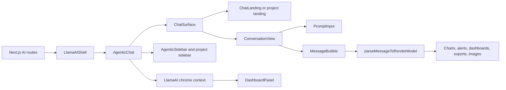
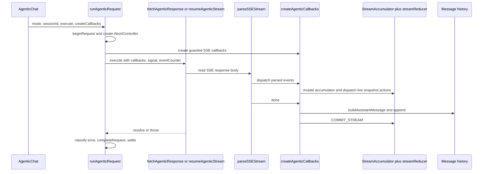
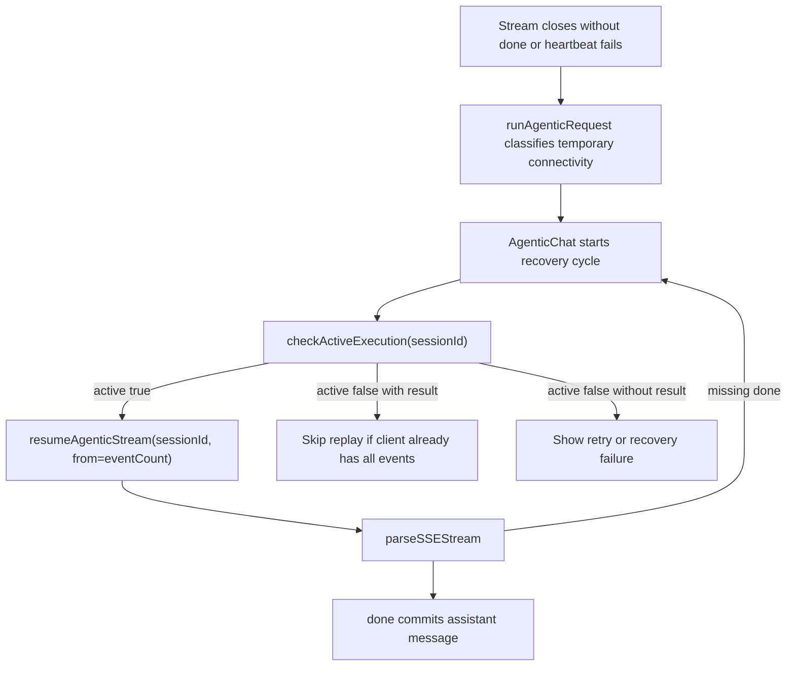
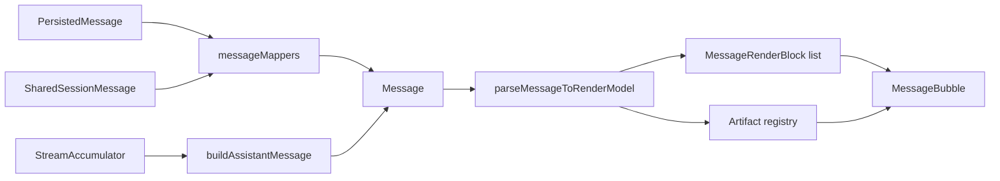
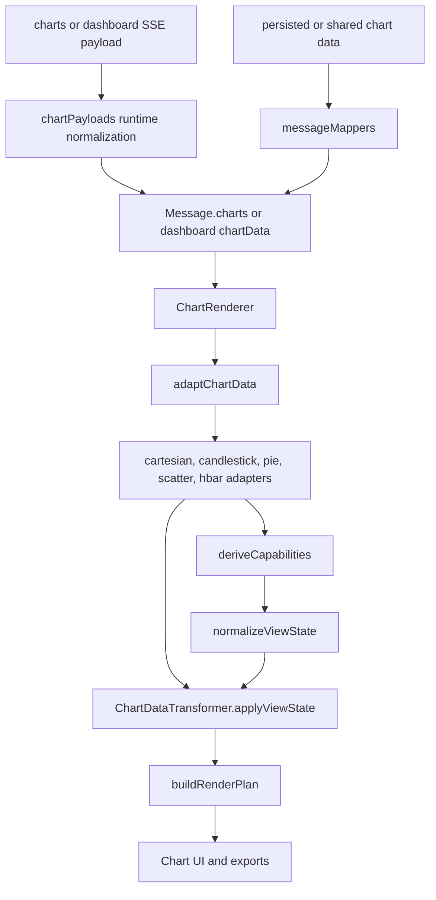
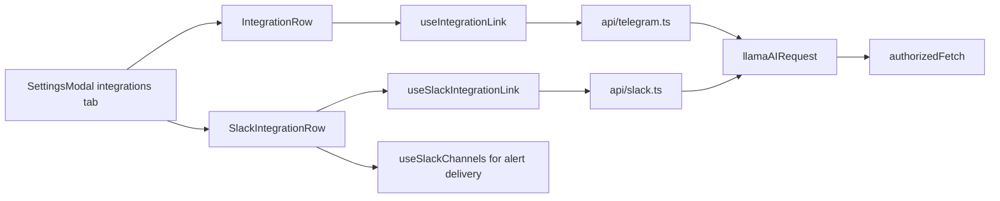
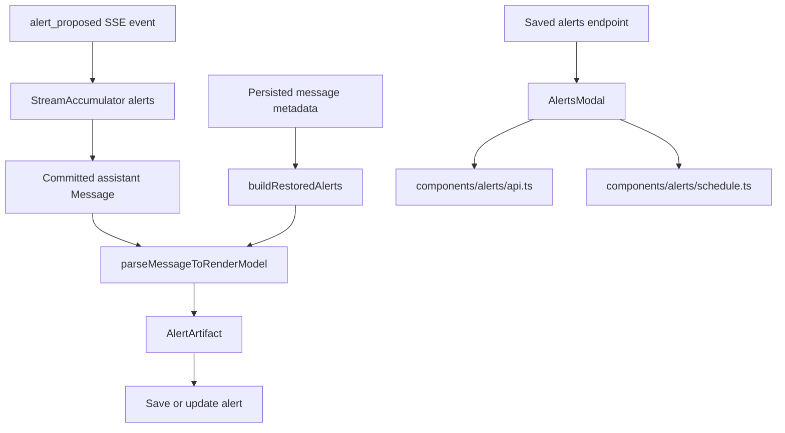
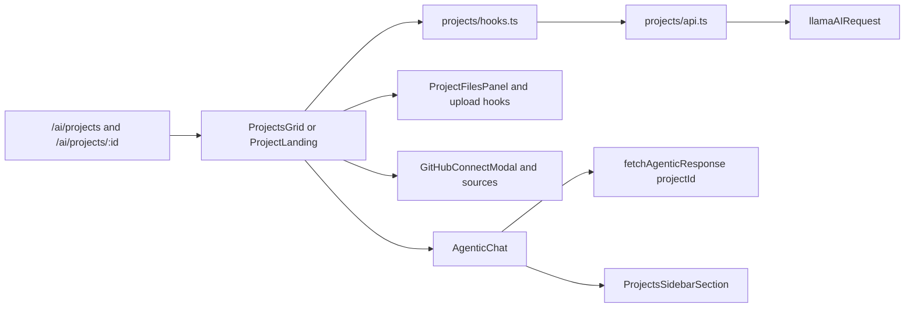

# LlamaAI Architecture

This document maps the durable LlamaAI boundaries. It is meant to help future
changes land in the right module without rediscovering the full chat, stream,
artifact, integration, alert, chart, and project flows.

## System Overview

`AgenticChat` is the orchestration shell. It owns the active session, request
lifecycle, recovery, pagination, branch edits, dashboard panel state, and route
side effects. The UI is split into surface and view modules so the shell can
wire state while render modules stay focused on presentation.

Key boundaries:

- `index.tsx` coordinates state and workflows.
- `components/ChatSurface.tsx` owns landing versus conversation branching.
- `components/ConversationView.tsx` renders the conversation from a
  `ConversationViewModel`.
- `components/messages/MessageBubble.tsx` renders individual messages through
  `renderModel.ts`.
- `chrome.ts` exposes page-level chrome state such as the dashboard panel.

## Request And Stream Lifecycle

All agentic prompt, edit, resume, and replay flows should go through
`runAgenticRequest`. That module begins request bookkeeping, creates the abort
controller, tracks event count, invokes the selected transport operation,
classifies errors, and completes the request.

Prompt mode is represented by `AgenticAnswerMode`: `quick`, `fact_checked`, or
`research`. Quick mode is the default and is omitted from the `/agentic` request
body; fact-checked and research prompts are sent as `mode`.

The stream has two representations by design:

- `StreamAccumulator` is a ref-owned mutable accumulator used for commit
  correctness, event counts, resume, and replay.
- `StreamState` is reducer-owned UI state for the live draft, progress panels,
  recovery, errors, and context warnings.
- Fact-check events are split: `fact_check_status` updates the live
  `factCheckPhase`, and `fact_check_citations` stores `factCheckReferences` for
  the committed assistant message and markdown renderer.

Do not bypass the guarded callbacks in `streamCallbacks.ts` when adding new SSE
events. Stale request protection belongs there.

## Deep Links

`/ai/chat?prompt=...` is confirmation-gated. Authenticated chat routes surface
`DeepLinkPromptModal` and only submit the prompt after user confirmation. The
unauthenticated `/ai/chat` page uses the same modal so shared prompt URLs never
auto-run work on page load.

## Recovery And Replay

Temporary connectivity failures preserve partial output and use backend active
execution state to decide whether to resume or replay.

Important invariants:

- `receivedEventCount` is the client's replay cursor.
- Missing `done` is a recovery signal unless the request was aborted.
- Abort is not shown as a user-facing failure.
- Resume and replay should share the same callback and lifecycle path as prompt
  and edit flows.

## Message And Artifact Model

Messages enter the UI from three sources: persisted restore, shared-session
restore, and live stream commit. All three should normalize into the domain
`Message` shape before rendering.

Artifact ownership:

- `messageMappers.ts` handles persisted and shared-session API shapes.
- `streamState.ts` builds committed assistant messages from stream output.
- `renderModel.ts` turns a message into markdown, source, artifact, and action
  blocks.
- Fact-check references flow through `Message.factCheckReferences`,
  `renderModel.ts`, `processFactCheckCitations`, the `fact-check-pill` sanitize
  allowlist, and `CitationPill`.
- `utils/restoredAlerts.ts` preserves historical saved and unsaved alert
  markers.
- `utils/reportMarkers.ts` centralizes `[REPORT_START]` stripping.

## Charts Pipeline

Chart payloads enter from JSON-parsed SSE frames and raw restored session JSON.
`chartPayloads.ts` normalizes these boundary values into the domain chart shapes
before rendering. Chart rendering then flows through adapter, capabilities,
transformer, render plan, and UI controls.

Rules for chart changes:

- Keep `utils/chartAdapter.ts` as the stable facade.
- Add chart-family behavior through the family adapter modules.
- Backend chart payload shape changes should be fixed at the API/SSE contract,
  not by filtering rows or configs in render code.
- Preserve public exports: `adaptChartData`, `adaptCandlestickData`, and
  `AdaptedChartData`.

## Integrations

Telegram and Slack use the shared LlamaAI transport and separate link-state
helpers. UI components should consume derived state, not duplicate polling or
pending-link rules.

Telegram flow:

- Fetch status from `/telegram/status`.
- Start link to get a pending token and deep link.
- Poll while pending.
- Confirm or unlink through the Telegram API module.

Slack flow:

- Fetch workspace link status from `/slack/status`.
- Start OAuth link and return to settings.
- List workspaces and channels for alert delivery.
- Unlink a workspace by team id.

## Alerts

Alerts can appear as streamed artifacts, restored message artifacts, and
editable saved alerts in the modal.

Alert module split:

- `components/alerts/api.ts` owns alert endpoint calls.
- `components/alerts/schedule.ts` owns schedule parsing, timezone labels, and
  blocked-hour helpers.
- `components/AlertsModal.tsx` owns modal composition and user interactions.

## Projects

Projects scope chat sessions and add project files, text notes, instructions,
and GitHub sources. Chat requests include `projectId` when the active session is
project-scoped.

Project ownership:

- `projects/api.ts` defines the backend endpoint contract.
- `projects/hooks.ts` wraps React Query behavior.
- `projects/queryKeys.ts` keeps cache keys stable.
- `CreateProjectModal` is shared by create and rename/edit project flows.
- `hooks/useSessionMutations.ts` updates global and project session caches when
  sessions are created, moved, deleted, or renamed.

## Test Map

The current useful test seams are:

- Transport contracts: `api/__tests__/transport.test.ts`.
- Agentic request lifecycle: `__tests__/runAgenticRequest.test.ts`.
- Agentic response contract: `__tests__/fetchAgenticResponse.test.ts`.
- Stream callback behavior: `__tests__/streamCallbacks.test.ts`.
- Message normalization: `__tests__/messageMappers.test.ts`.
- Chart payload boundaries: `__tests__/chartPayloads.test.ts`.
- Fact-check mode and SSE behavior:
  `__tests__/fetchAgenticResponse.test.ts`,
  `__tests__/streamCallbacks.test.ts`, and markdown renderer/helper tests.
- Route and request helpers: `__tests__/routeTransition.test.ts`,
  `__tests__/requestLifecycle.test.ts`.
- Integration state helpers:
  `hooks/__tests__/useIntegrationLink.test.ts`.

Prefer adding behavior tests at these stable seams before adding component-level
tests or new harness infrastructure.
